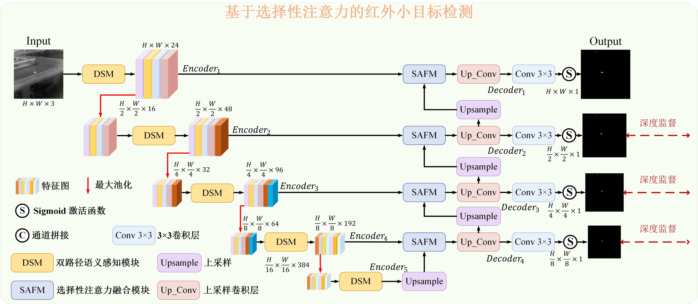
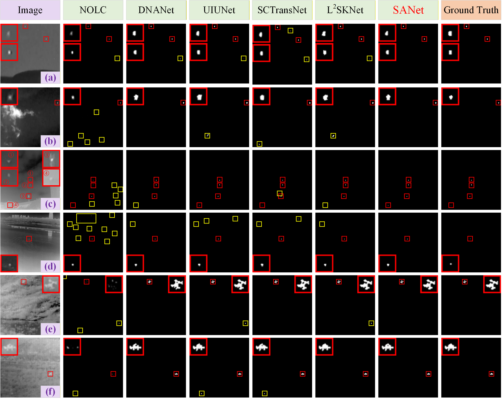
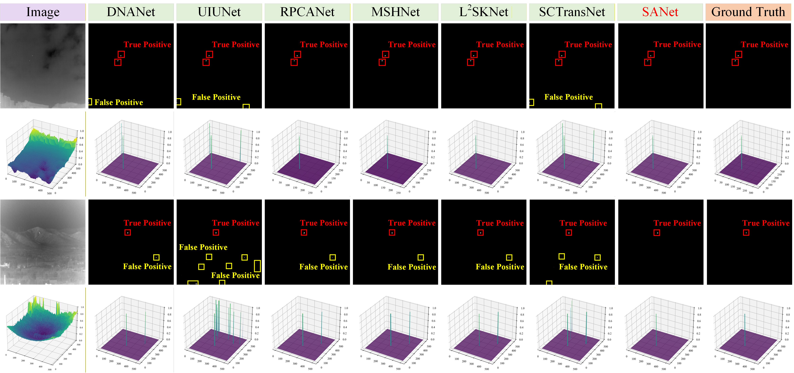

# 基于选择性注意力的红外小目标检测
On October 17, 2025, our paper was officially accepted by the *Journal of Image and Graphics*（中国图象图形学报）. We sincerely thank all the reviewers and editors for their valuable comments and patient guidance during the review process, which played a crucial role in improving the quality of the paper. We are deeply honored and express our heartfelt gratitude for their support and assistance. [[Paper]](https://www.cjig.cn/zh/article/doi/10.11834/jig.250313/)

## Network

## Recommended Environment
 - [ ] python  3.11.7
 - [ ] pytorch 2.2.1
 - [ ] torchvision 0.17.1

## Datasets
**Our project has the following structure:**
  ```
  ├───dataset/
  │    ├── NUAA-SIRST
  │    │    ├── image
  │    │    │    ├── Misc_1.png
  │    │    │    ├── Misc_2.png
  │    │    │    ├── ...
  │    │    ├── mask
  │    │    │    ├── Misc_1.png
  │    │    │    ├── Misc_2.png
  │    │    │    ├── ...
  │    │    ├── train_NUAA-SIRST.txt
  │    │    │── train_NUAA-SIRST.txt
  │    ├── IRSTD-1K
  │    │    ├── image
  │    │    │    ├── XDU0.png
  │    │    │    ├── XDU1.png
  │    │    │    ├── ...
  │    │    ├── mask
  │    │    │    ├── XDU0.png
  │    │    │    ├── XDU1.png
  │    │    │    ├── ...
  │    │    ├── train_IRSTD-1K.txt
  │    │    ├── train_IRSTD-1K.txt
  │    ├── ...  
  ```
<be>

## Results
#### Visualization results

#### 3D visualization results


#### Quantitative Results on NUAA-SIRST, IRSTD-1K, NUDT-SIRST and SIRSTAUG

| Dataset         | IoU (x10(-2)) | nIoU (x10(-2)) | Pd(x10(-2))| Fa (x10(-6))|
| ------------- |:-------------:|:-------------:|:-----:|:-----:|
| NUAA-SIRST    | 79.10  | 80.01  |  96.58 | 11.52 |
| IRSTD-1K      | 71.70  | 66.59  |  93.27 | 11.88 |
| NUDT-SIRST    | 95.73  | 95.43  |  99.26 | 2.80  |

## Citation
If you found this project helpful, please give us a star. If HAFNet has inspired you, please consider citing it. Thank you!
```
@ARTICLE{JIG202603013,
  author={Yingmei Zhang and Wangtao Bao and Qin Xiao and Yong Yang and Weiguo Wan and Yitao Luo and Xueting Zou and Lei Zhang},
  journal={中国图象图形学报},
  title={基于选择性注意力的红外小目标检测},
  year={2026},
  volume={31},
  number={3},
  pages={0797-0810},
  doi={10.11834/jig.250313}
}
```


